# Estructura de Base de Datos - Isamisa NubeFact

Este directorio contiene la documentación visual de la base de datos, incluyendo las tablas originales del ERP (modificadas) y las tablas nuevas de la aplicación web.

## Contenido

- [modelo_er.mmd](./modelo_er.mmd): Código fuente en formato Mermaid.
- [modelo_er.svg](./modelo_er.svg): Diagrama Entidad-Relación exportado en formato SVG.

## Diagrama (Vista Previa)

---

### Descripción de Módulos

1. **Ventas**: `AR_Document`, `AR_DocumentDetail`, `AR_FE_Nube`.
2. **Guías**: `WH_Transaction`, `WH_TransactionDetail`, `wh_transaction_nube`.
3. **Retenciones**: `AP_Retencion`, `AP_RetencionDetail`, `AP_Retencion_Status`.
4. **Sistema**: `users`, `auditoria`, `sy_configuracion_envio`.
